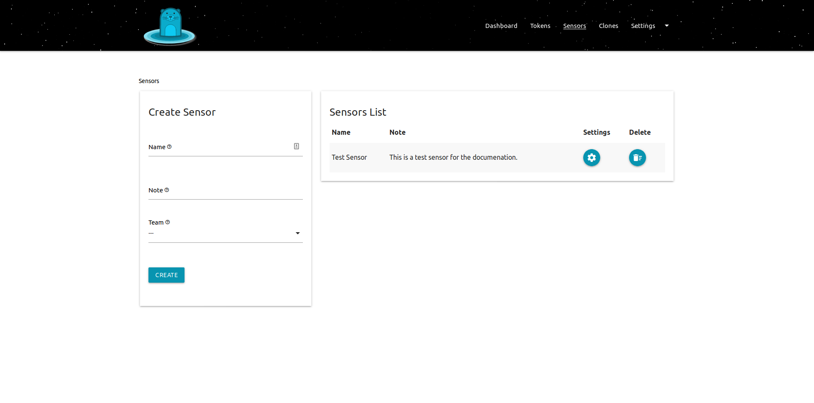
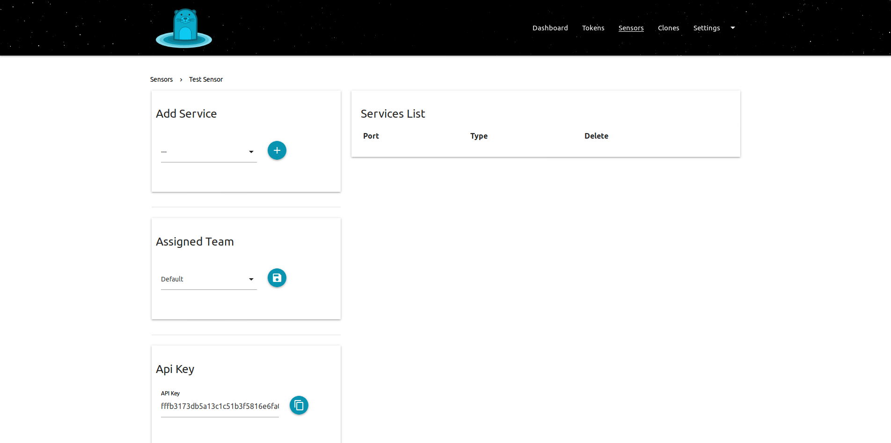

# Setup

## Overview

The Kushtaka executable also acts as a `sensor` when you pass it the `-sensor` flag. Configurations are downloaded by the sensor from the server as long as the `sensor` has been configured with the `-apikey` and the `-host` values.

## Steps

* [ ] Create a `sensor` on the the `server's` dashboard
* [ ] Copy the `sensor's` apikey to your clipboard and **configure** the sensor
* [ ] Run `kushtakad` by passing the `-sensor` flag 

### Create Sensor



### Copy Api Key



### Configure Sensor

```text
$ kushtakad -apikey YOUR_API_KEY -host URI_OF_SERVER
```

### Run Sensor

```text
$ kushtakad -sensor
```

## Examples

Examples of the **data/sensor.json** file that is created.

### Command

```text
$ kushtakad -apikey 9ac35aeacfd5a951a64794c75f3Bf0bc448671ab6e62a0d71993aca98c76f545 -host http://localhost:8080 
```

### Practical 

```text
{
	"key": "9ac35aeacfd5a951a64794c75f3Bf0bc448671ab6e62a0d71993aca98c76f545",
	"host": "http://localhost:8080"
}
```

### Sensor.json Example 

```text
{
	"key": "THE_SENSORS_API_KEY",
	"host": "THE_URI_OF_THE_CONFIGURATOR"
}
```

### Directory Listing

```text
$ ls data/
acme  clones  images  kushtaka.db  logs  sensor.db  sensor.json  server.json  sessions  tmp
$
```

