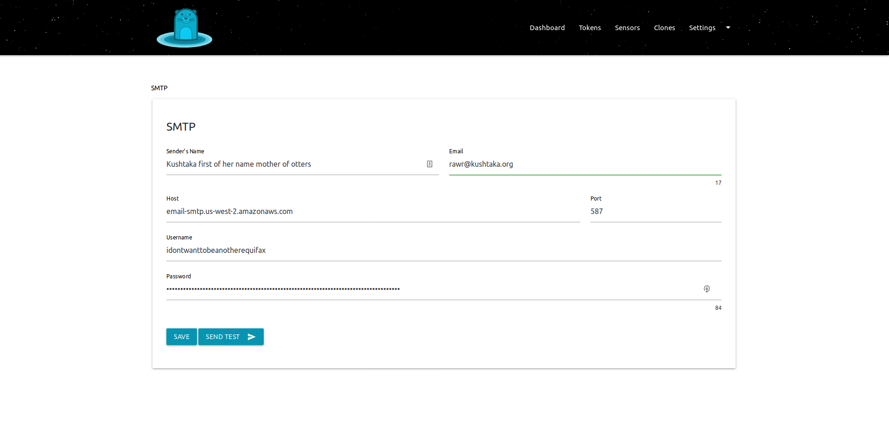

# Alerting with SMTP

## Outline

For `kushtakad` to provide the value your organization requires you must configure `SMTP` for email alerts. These alerts are sent when the `tokens` or `sensors` are triggered. 

## Steps

* [ ] Find the `SMTP` screen on the `kushtakad` dashboard
* [ ] Enter in the name for the `sender` and the `email` address from which alerts will be sent
* [ ] Enter the `hostname` and the `port` of the server
* [ ] If authentication is required enter in the `username` and `password`
* [ ] Click the `SEND TEST` button
* [ ] If the test email was recieved, click `SAVE` 

