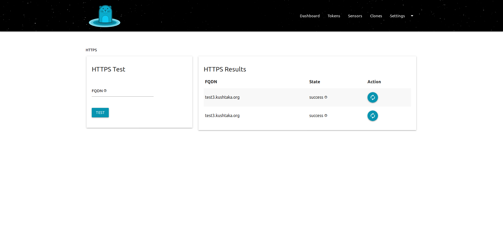

# Automatic HTTPS

## Outline

If simply evaluating `kushtakad` it is fine to run it in an environment with no ssl encryption. But when you place `kushtakad` into your **production** environment, you should then configure and deploy it with automatic HTTPS.   
  
As `kushtakad` has tried to simplify this process in order to remove as much friction as possible there is very little initial time investment. Once configured `kushtakad` will automatically update the `ssl` certificate behind the scenes. This removes the need for `ssl` maintenance from your staff and more importanly, keeps your traffic secure.  
  
**\***Please note, the only available Let's Encrypt authentication method as of this version is `http`.

## Steps

1. [ ] Create a `DNS (A)` record that points to the external ip address of the production `kushtakad` server
2. [ ] Navigate to the HTTPS screen on the `kushtakad` dashboard
3. [ ] Enter the DNS name of the `kushtakad` server into the`FQDN` field
4. [ ] Click the `submit` button 
5. [ ] A test will take place to see if you have implemented the `DNS (A)` record correctly
6. [ ] If the test passes, you can click the `reboot` button under the `action` column
7. [ ] The server will then acquire a production ssl certificate and reboot
8. [ ] 30 days before expiration the certificate will be automatically renewed
9. [ ] This process will happen indefinitely

