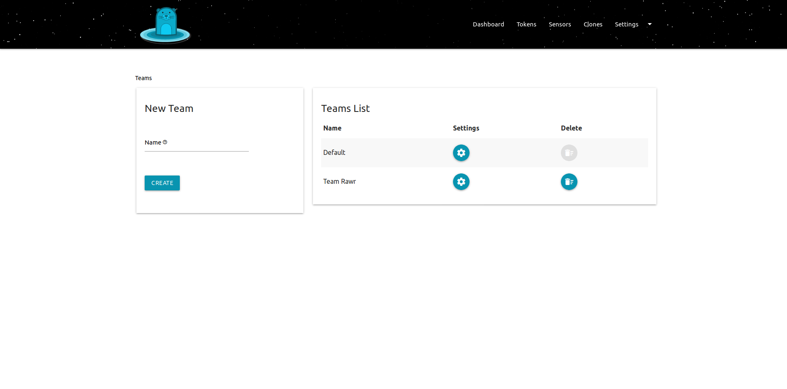
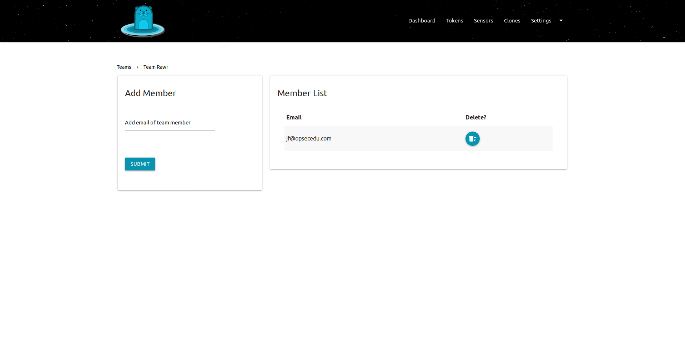

# Teams

## Outline

Kushtaka anticipates that you will have many `kushtakad` executables running in `-sensor` mode. It also expects that you will `segment` your network strategically with different network and systems administrators in charge of these `segments` and the `assets` or `servers`on them.  
  
Therefore Kushtaka allows you to create many teams as teams are simply groups of email addresses. And when a `sensor` is attacked by one of those darn hackers, it will alert only the team that has been assigned to the `sensor`. Keeping noise low and signals high.

## Steps

* [ ] Find the `Teams` screen on the `kushtakad` dashboard
* [ ] You will see that a `default` team was already created upon initial setup 
* [ ] Enter in a new `team` name
* [ ] Click the `settings` button
* [ ] Enter any `email` addresses for the team's members and click `SAVE`

