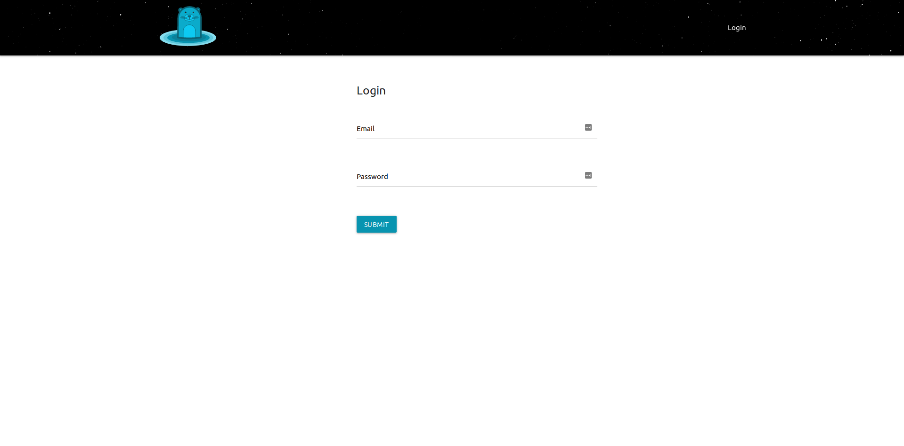

# Initial Setup

## Outline

When running `kushtakad` for the first time in `configurator` mode \(which is the default\) you will want to navigate to either:  
  
`http://localhost:8080`or `http://YOUR_EXTERNAL_IP:8080`

You'll be confronted with the following screen and forced to set the admin user's default email address and password.

## Steps

* [ ] Enter an email address
* [ ] Enter a &gt;= 12 character password
* [ ] Confirm the password
* [ ] Click the `SAVE` button
* [ ] At the login screen
* [ ] Enter the email address used on the setup screen
* [ ] Enter the password you used on the setup screen
* [ ] Click the `SUBMIT` button

## Setup

## Login

