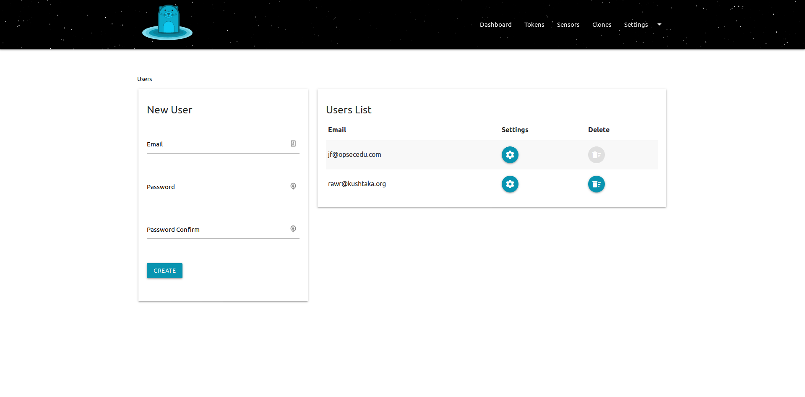

# Users

## Outline

Assuming that you will have several people in your organization that will be responsible for Kushtaka, `kushtakad` allows you to add additional admin users using the dashboard. 

These users have full admin privileges as there are no roles. Note that you are unable to delete the `initial` admin user used during

## Steps

* [ ] Enter the user's email address
* [ ] Enter the users desired password
* [ ] Confirm the password by entering it a 2nd time
* [ ] Click the `CREATE` button

